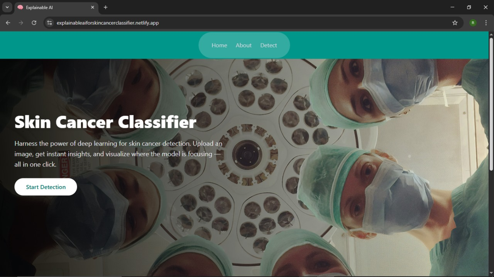
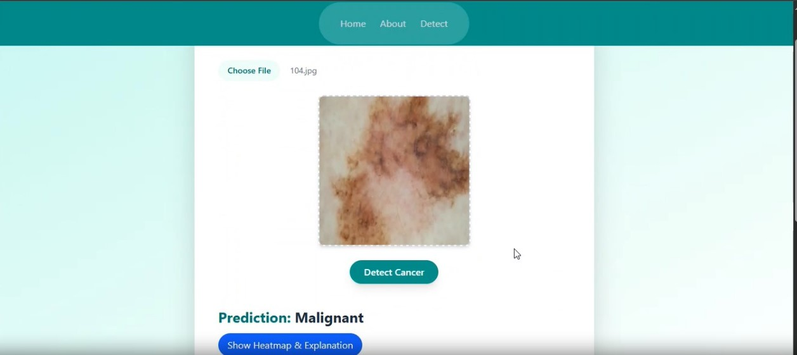
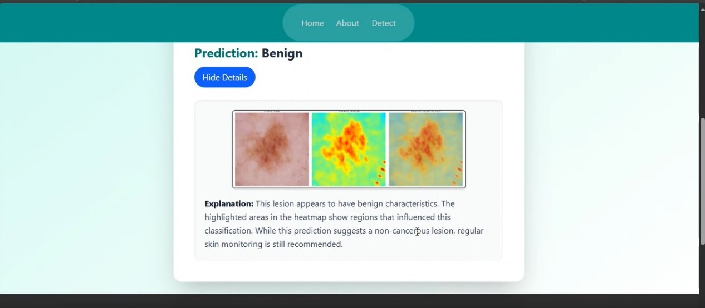
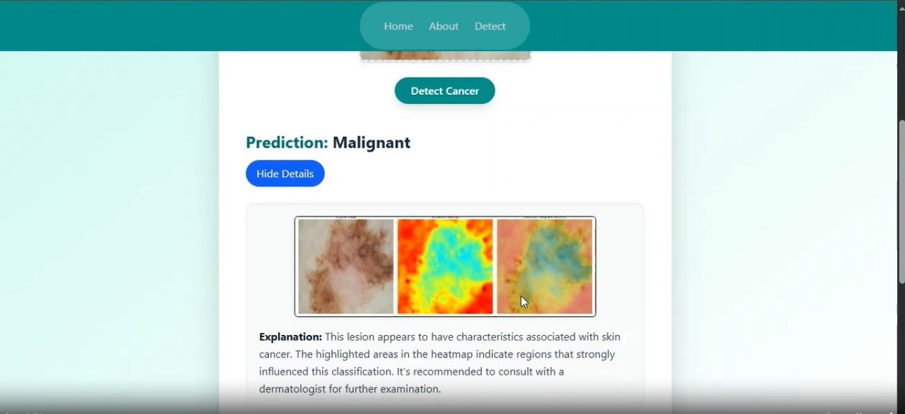

  

<em>Figure: Home Page</em>

  

<em>Figure: Selecting an image for classification.</em>

  

<em>Figure: Heatmap generated by Grad-CAM showing model focus region(Benign)</em>

  

<em>Figure: Heatmap generated by Grad-CAM showing model focus region(Malignant)</em>

  

    

  🔗&nbsp; <a href="https://explainableaiforskincancerclassifier.netlify.app/" target="_blank"><strong>Live Demo</strong></a>

    

  

<h1 align="center">Skin Cancer Classifier</h1>

  

  

  

<!-- Status -->

<h4 align="center"> 
	✅ Synthack is deployed on Netlify and functional!  
	  
	🚀 To use it, first run the Colab backend and connect it to the frontend using the ngrok URL.
</h4>

  <a href="#dart-about">About</a> &#xa0; | &#xa0; 
  <a href="#sparkles-features">Features</a> &#xa0; | &#xa0;
  <a href="#rocket-technologies">Technologies</a> &#xa0; | &#xa0;
  <a href="#white_check_mark-requirements">Requirements</a> &#xa0; | &#xa0;
  <a href="https://github.com/{{YOUR_GITHUB_USERNAME}}" target="_blank">Author</a>

 

## :dart: About ##

Explainable AI for Skin Cancer Classification is an AI-powered diagnostic tool designed to support early detection of skin cancer, where timely diagnosis is critical for effective treatment. Manual methods are often slow and reliant on expert availability, creating a need for faster, scalable solutions. This model offers accurate predictions using visual inputs and enhances trust through **Grad-CAM(Gradient-weighted Class Activation Mapping) heatmaps**, which highlight key image areas influencing the outcome making the diagnostic process both transparent and efficient.

Beyond speed and accuracy, the model provides natural language explanations detailing why a lesion is considered benign or malignant, based on visual features like color variation or border asymmetry. This promotes greater trust in AI outputs, especially in clinical settings. Importantly, the system is designed to **assist doctors not replace them** by offering interpretable insights that complement human expertise. It contributes to accessible and trustworthy healthcare, bridging technology with real-world medical needs.

## :sparkles: Features ##

:heavy_check_mark: Skin cancer classification into **benign** or **malignant** using a trained ML model;\
:heavy_check_mark: Visual explanation using **Grad-CAM heatmaps** to highlight key image regions;\
:heavy_check_mark: **User-friendly interface** with support for uploading skin lesion images ;\
:heavy_check_mark: Helps **doctors and medical professionals** by enhancing diagnostic confidence
 

## :rocket: Technologies ##

The following tools were used in this project:

- [Flask](https://flask.palletsprojects.com/) – Lightweight backend API framework  
- [Google Colab](https://colab.research.google.com/) – For hosting and running the ML model  
- [ngrok](https://ngrok.com/) – To expose the Colab backend to the frontend  
- [Grad-CAM](https://arxiv.org/abs/1610.02391) – For visual explanation of model predictions 
- [React](https://pt-br.reactjs.org/) - Frontend
- [Tailwind CSS](https://tailwindcss.com/) – CSS framework for styling
- [Netlify](https://www.netlify.com/) – For frontend deployment

## :white_check_mark: Requirements ##

Before starting :checkered_flag:, you need to have [Git](https://git-scm.com) and [Node](https://nodejs.org/en/) installed.

Made with :heart: by 
 
<a href="https://github.com/sanikaijantakar" target="_blank">Sanika Ijantakar</a>
 
<a href="https://github.com/sanikaijantakar" target="_blank">Sahana Patil</a>
 
<a href="https://github.com/Ritu-S-M" target="_blank">Ritu Mathad</a>

&#xa0;

<a href="#top">Back to top</a>
